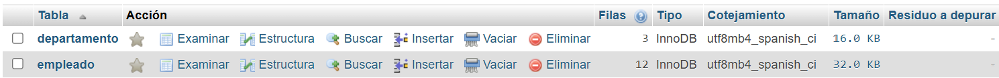
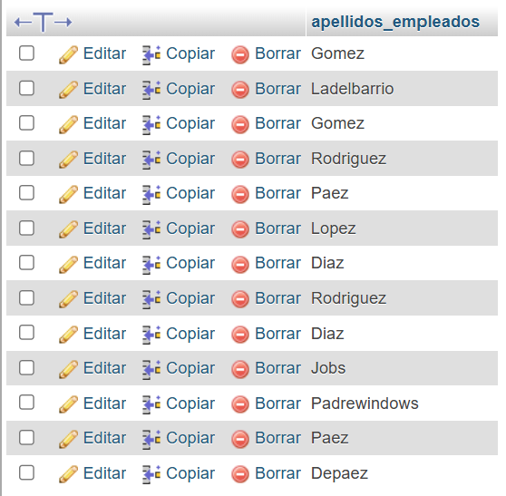

# Consultas de SQL, actividad #2

## Modelo físico de la base de datos

## Estructura de la BD

## Consultas a la BD

1. Obtener la lista de los apellidos de todos los empleados.

`SELECT apellidos_empleados FROM empleado;`

