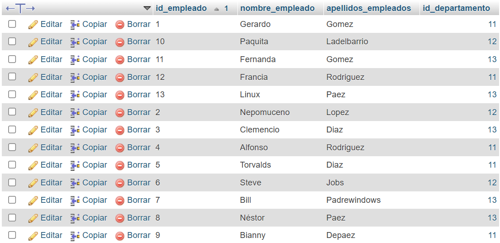
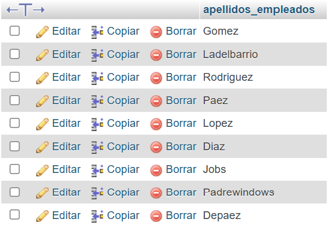
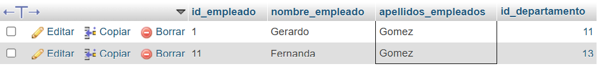
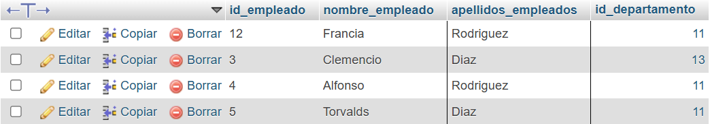
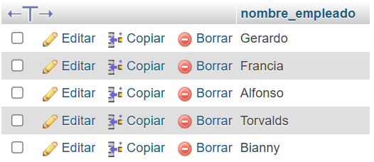
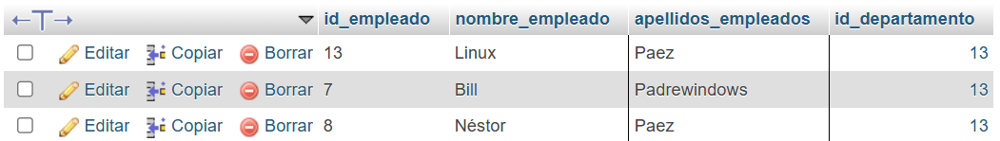
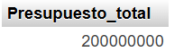
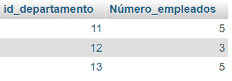
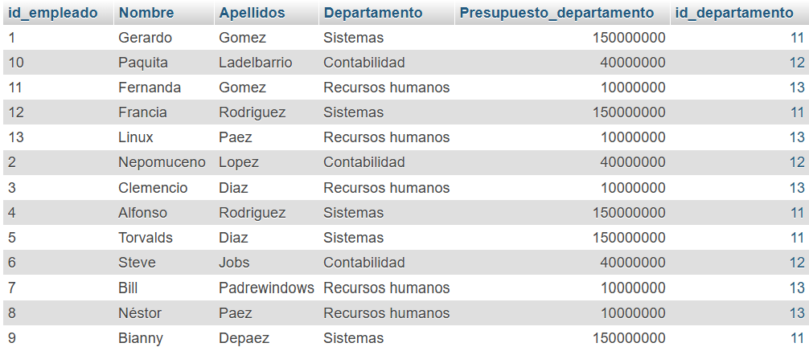
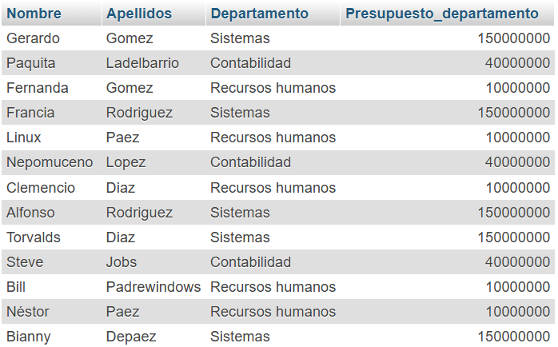

# Consultas de SQL, actividad #2

## Modelo físico de la base de datos

## Estructura de la BD

## Tabla de empleados

## Consultas a la BD

1. Obtener la lista de los apellidos de todos los empleados.

`SELECT apellidos_empleados FROM empleado;`

2. Obtener los apellidos de todos los empleados sin repeticiones.

`SELECT DISTINCT apellidos_empleados FROM empleado;`

3. Obtener todos los datos de los empleados que se apellidan 'Gomez'.

`SELECT * FROM empleado WHERE apellidos_empleados = 'Gomez';`

4. Obtener todos los datos de los empleados que se apellidan "Diaz" y los que se apellidan "Rodriguez".  Usar OR o IN

`SELECT * FROM empleado WHERE apellidos_empleados = 'Diaz' OR apellidos_empleados = 'Rodriguez';`

5. Obtener los nombres de los empleados que trabajan en el departamento 11

`SELECT nombre_empleado FROM empleado WHERE id_departamento = 11;`

6. Obtener todos los datos de los empleados cuyo apellido empiece por 'P'

`SELECT * FROM empleado WHERE apellidos_empleados LIKE 'P%';`

7. Obtener el presupuesto total de todos los departamentos.

`SELECT SUM(presupuesto_departamento) AS Presupuesto_total FROM departamento;`

8. Obtener el número de empleados de cada departamento.

`SELECT id_departamento, COUNT(*) AS Número_empleados FROM empleado GROUP BY id_departamento;`

9. Obtener un listado completo de empleados, incluyendo por cada empleado los datos del empleado y de su departamento.

`SELECT empleado.id_empleado, empleado.nombre_empleado as Nombre, empleado.apellidos_empleados AS Apellidos, departamento.nombre_departamento AS Departamento, departamento.presupuesto_departamento AS Presupuesto_departamento, departamento.id_departamento FROM empleado JOIN departamento ON empleado.id_departamento = departamento.id_departamento;`

10. Obtener un listado completo de empleados, incluyendo el nombre y apellidos del empleado junto al nombre y presupuesto de su departamento.

`SELECT empleado.nombre_empleado as Nombre, empleado.apellidos_empleados AS Apellidos, departamento.nombre_departamento AS Departamento, departamento.presupuesto_departamento AS Presupuesto_departamento FROM empleado JOIN departamento ON empleado.id_departamento = departamento.id_departamento;`

