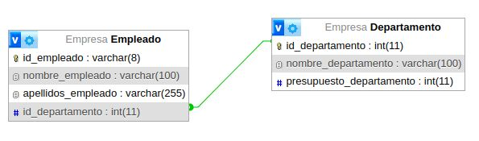

# Consultas de SQL, actividad #2

## Modelo físico de la base de datos

## Estructura de la BD

## Tabla de empleados

## Consultas a la BD

1. Obtener la lista de los apellidos de todos los empleados.

`SELECT apellidos_empleados FROM empleado;`

2. Obtener los apellidos de todos los empleados sin repeticiones.

`SELECT DISTINCT apellidos_empleados FROM empleado;`

3. Obtener todos los datos de los empleados que se apellidan 'Gomez'.

`SELECT * FROM empleado WHERE apellidos_empleados = 'Gomez';`

4. Obtener todos los datos de los empleados que se apellidan "Diaz" y los que se apellidan "Rodriguez".  Usar OR o IN

`SELECT * FROM empleado WHERE apellidos_empleados = 'Diaz' OR apellidos_empleados = 'Rodriguez';`

5. Obtener los nombres de los empleados que trabajan en el departamento 11

`SELECT nombre_empleado FROM empleado WHERE id_departamento = 11;`

6. Obtener todos los datos de los empleados cuyo apellido empiece por 'P'

`SELECT * FROM empleado WHERE apellidos_empleados LIKE 'P%';`

7. Obtener el presupuesto total de todos los departamentos.

`SELECT SUM(presupuesto_departamento) AS Presupuesto_total FROM departamento;`

